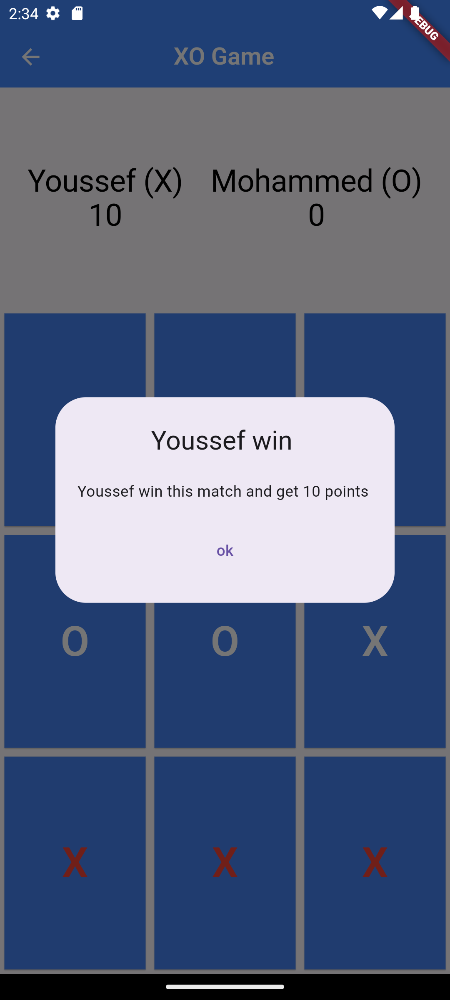

# x_o_game_flutter

## X-O Game

Welcome to the ultimate X O Game, where classic Tic Tac Toe fun meets modern convenience! Challenge your friends and see who can master the grid. Our X O Game app offers a seamless and engaging experience with two main screens designed for easy and enjoyable gameplay.

## Features:

1. **Player Setup Screen:**
    - Enter Player Names: Start by inputting the names of Player 1 and Player 2.
    - Easy Navigation: Simple and intuitive interface for quick setup.

2. **Game Board Screen:**
    - Interactive Game Board: Enjoy a visually appealing and responsive Tic Tac Toe grid.
    - Real-time Score Tracking: Keep track of each player's score at the top of the screen.
    - Winner Notification: Instantly know who wins each round with a clear notification.
    - Score Update: Automatically add 10 points to the winner's score after each game.

Challenge your friends, track your victories, and enjoy the timeless fun of Tic Tac Toe with our X O Game app. Perfect for quick matches and extended play sessions alike!

## Screenshots

